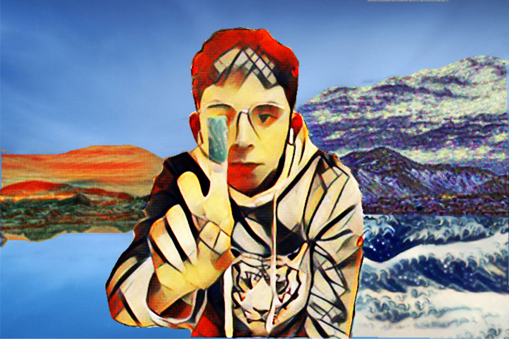

# StylePuzzle-Openframework
Openframework implementation of StylePuzzle for stylization with user interaction
Course project for Course CS4187 Computer Vision for Interactivity

## Motivation
StylePuzzle can enable users to select the target the region that they want to conduct stylization. Specifically, with the mouse click and drag operation, since they are very convenient to perform while preserving high accuracy. I have to emphasize that user interaction to change the regional style will definitely make a difference to the stylized image because single style transfer doesn’t always the desirable appearance in every corner of the synthesized image. To resolve this issue, StylePuzzle utilize several style-transfer models (either style-specific model or arbitrary style transfer model) and refine the results by combing the good parts of different stylized images (synthesized by those models) and jointly eliminate noises.

## 

