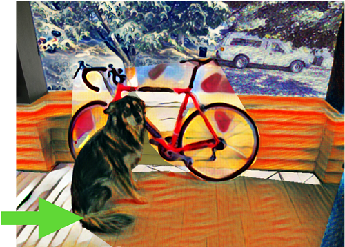

# StylePuzzle-Openframework-Implementation
Openframework implementation of StylePuzzle for stylization with user interaction.
Course project for Course **CS4187 Computer Vision for Interactivity**.

## Motivation
StylePuzzle enables users to select the target the region that they want to conduct stylization. Specifically, with the mouse click and drag operation, since they are very convenient to perform while preserving high accuracy. I have to emphasize that user interaction to change the regional style will definitely make a difference to the stylized image because single style transfer doesn’t always the desirable appearance in every corner of the synthesized image. To resolve this issue, StylePuzzle utilize several style-transfer models (either style-specific model or arbitrary style transfer model) and refine the results by combing the good parts of different stylized images (synthesized by those models) and jointly eliminate noises.

## Dependence
**Python3.7**  
**openframework**  
**container** (sudo pip3 install chainer; Not necessary, depending on the model you choose)  
Related **pertained style-transfer models**: (e.g.)  
Style Model Github: https://github.com/yusuketomoto/chainer-fast-neuralstyle 

## Basic Settings and Steps to Reproduce
1. Choose one style transfer model implementation.  
2. Create an openframework project, replace src with .cpp files in this repository.  
3. Before start, adjust file and path settings in the ofApp.h (including CUDA, path to style-transfer models&codes, input image name, background image name, style reference models, threads)

## Basic Operation of StylePuzzle
Detailed instructions are available in the interface. Basic Flowchart:    
  

## Results
Demo video: https://drive.google.com/open?id=1MIwDznpYj8tPeGjwzdXo98LMp4dGthOj  
Sample images:  

## Future Work
  
 Smooth the boundaries between different styles.

